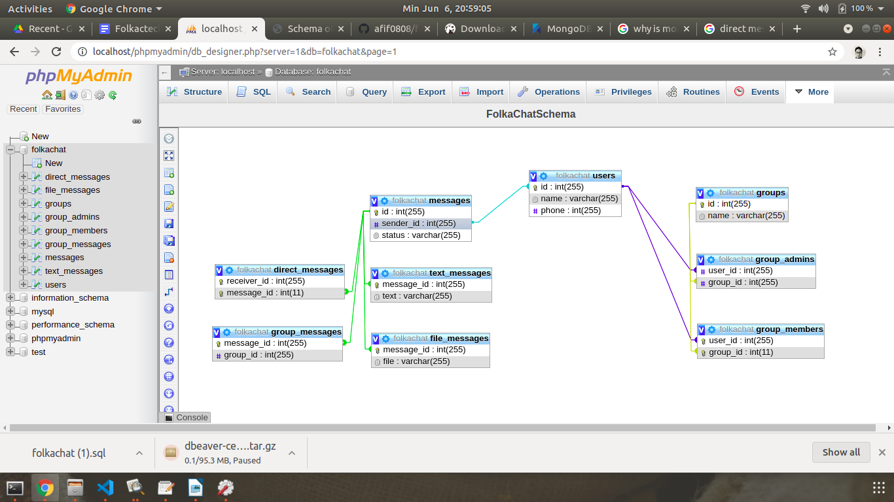
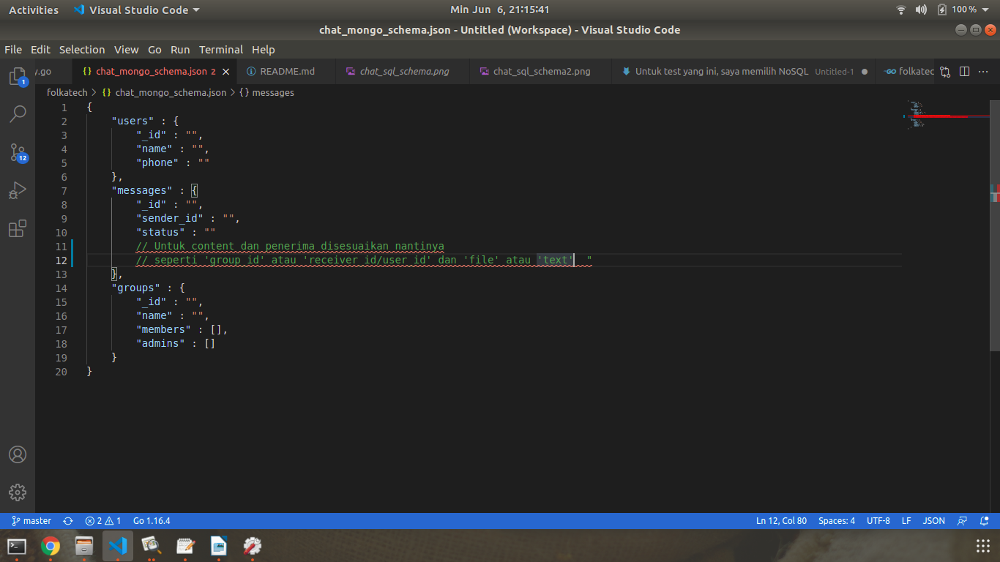

<h1>Folkatech Interview Test</h1>

Halo, sebelumnya terima kasih untuk mengizinkan saya untuk menjalani test ini. 

Repository ini berisi hasil test yang saya kerjakan. 

Dibawah saya akan menjelaskan tentang skema database basic chat messaging application. Tapi sebelumnya saya minta maaf kalau kode saya kurang rapih , karena waktu saya
tidak bisa merapikan semua kodenya ( penamaan variable , urutan algoritma yang lebih rapih ,dll ) , namun saya sudah yakin kalau saya sudah berhasil jawab testnya dan 
jika ada waktu saya insya allah bisa merapikan kodenya menjadi lebih baik. 

<h2>Basic Chat Messaging System Database</h2>

Untuk test yang ini, saya memilih NoSQL yaitu MongoDB. Alasanya ialah karena berdasarkan dari apa yang saya baca , MongoDB lebih cepat dari MySQL, namun saya belum mengerti semua alasanya , tapi untuk kebutuhan yang ini menurut saya MongoDB adalah pilihan yang sesuai.

Dengan SQL saya mendesain chat messaging app seperti ini 

Saya mengaplikasian one-to-one relationship untuk table message dan many-to-many relationship untuk group. Table messages hanya berisi message.id , message.receiver_id( user_id ) dan message.status( pending/sent/read ) , tidak termasuk field untuk isi dari pesan dan penerimanya.

Untuk penerima , saya membuat dua table terpisah yaitu direct message dan group message yang mana masing-masing berhubungan secara one-to-one dengan table message. Alasanya saya menerapkanya ialah agar , jika nanti kedua jenis pesan membutuhkan field tambahan kita tidak perlu menyentuh table message lagi atau jika nantinya ada jenis pesan baru berdasarkan penerimanya. Begitu pun , untuk isi pesan , saya membuat dua table yaitu text message dan file message.

Untuk member dan admin group, di aplikasikan many-to-many relationship. Ada dua junction table (table yang menghubungkan dua table) yaitu group_admins dan group_members yang masing-masing menghubungkan user dan group.

MongoDB memungkinkan kita untuk mengaplikasikan hal serupa tanpa membuat banyak table , karena MongoDB merupakan unstructured database , setiap baris bisa memiliki jumlah dan jenis2 field yang berbeda dalam sebuah collection dan many-to-many relationship bisa digantikan dengna embedded relationship dimana setiap id atau bahkan keseluruhan baris di dalam array.

Dengan begitu , kita tidak perlu melakukan banyak query untuk setiap pengembilan data. 

<h2>MongoDB Schema</h2>

Maaf untuk skema mongodb , saya menggunakan file JSON karena keterbatasan tool dan waktu . Semoga jelas.

