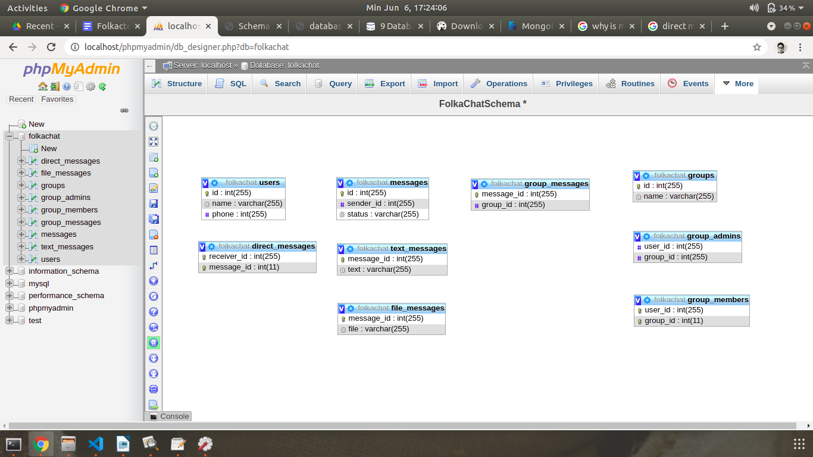

<h1>Folkatech Interview Test</h1>

Halo, sebelumnya terima kasih untuk mengizinkan saya untuk menjalani test ini. 

Repository ini berisi hasil test yang saya kerjakan. 

Dibawah saya akan menjelaskan tentang skema database basic chat messaging application. Tapi sebelumnya saya minta maaf kalau kode saya kurang rapih , karena waktu saya
tidak bisa merapikan semua kodenya ( penamaan variable , urutan algoritma yang lebih rapih ,dll ) , namun saya sudah yakin kalau saya sudah berhasil jawab testnya dan 
jika ada waktu saya insya allah bisa merapikan kodenya menjadi lebih baik. 

<h2>Basic Chat Messaging System Database</h2>

Untuk test yang ini, saya memilih NoSQL yaitu MongoDB. Alasanya ialah karena berdasarkan dari apa yang saya baca , MongoDB lebih cepat dari MySQL, namun saya belum mengerti semua alasanya , tapi untuk kebutuhan yang ini menurut saya MongoDB adalah pilihan yang sesuai.

<h3>Hubungan antar entity</h3>

Dengan SQL saya mendesain chat messaging app seperti ini 

